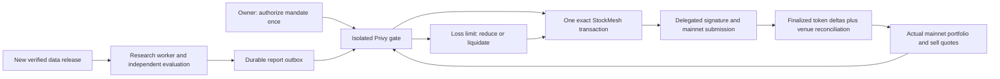

# Continuous trading

An owner authorizes an operating mandate once, rather than signing each new
allocation. The isolated signer then observes the portfolio, adopts fresh eligible
research, trades one leg, reconciles settlement, and observes again. A balanced
portfolio remains `ACTIVE / WATCHING`. It does not finish as `COMPLETE`.



## Initial setup

Connect the personal Solana wallet and its already enrolled Privy agent wallet.
Complete research for the selected strategy. In **Continuous trading**, set the
managed capital, cumulative buy turnover, maximum buy size, and transaction
allowance. Choose automatic liquidation or a 50% reduction at the displayed loss
limit. Review the exact message and choose **Authorize once and start**.

The owner signs `STA continuing trading authority v1\n` plus the canonical
configuration using Ed25519. It binds the exact owner, delegated wallet, strategy
brief, goals, allowed mints and decimals, risk behavior, timing and budgets. This
signature itself transfers no funds. Only activation of that exact configuration
enables the existing delegated signer. No new approval is requested for a fresh
research result or an ordinary subsequent trade. Pause, resume within the existing
mandate, and irreversible revocation are owner controls.

Limits are chosen by the owner. There is no hardcoded dollar cap or one-hour
operating expiry. `expiresAt: "0"` means until pause, revocation or exhaustion of
the owner's spending/transaction allowances. Cumulative turnover counts gross
buys: sale proceeds do not reset it. Reserved allowances remain consumed after an
unsuccessful attempt. This conservative accounting prevents restart/refund races.
Capital is an exposure budget, not a separate custodial account.

## Decision and settlement semantics

Only a fresh report matching the signed brief and goals can authorize new buys.
The result hash, universe, integer weights, concentration, cash reserve, held-out
drawdown and doubled-cost checks are independently checked. A candidate marked as
recommended on training is chosen before a stable identifier tie-break; the
controller never selects whichever candidate happened to win on held-out returns.

The portfolio is valued from current held-product sell minimums, using actual raw
token amounts rather than display-scaled shares. Excess positions are sold before
new buys. After every leg, actual finalized source debits and destination credits
and the venue's reconciled order must agree before another trade is admitted.
Receipt slots fence the next portfolio read. Expected sale proceeds, a signature,
an HTTP success or a transaction hash never count as delivered funds.

Drawdown uses a persistent high-water mark. Verified fill deltas are applied
before distinguishing external cash transfers from investment performance.
Unexplained stock movements block admission without resetting the loss baseline.
At the loss limit, new buys stop immediately. Liquidation sells all allowed held
positions; reduction freezes a target number of raw tokens once, so later price
changes cannot repeatedly halve the position. Risk exits bypass normal rebalance
bands and minimum-notional filters, but still require a valid venue quote and
positive output. An illiquid or unquotable position cannot be guaranteed sold.
Risk remains latched after recovery; a replacement mandate is required to re-enter.

The last allowance slot per allowed asset is reserved for risk exits. All exits
still obey the total signed transaction and fee allowances, actual liquidity,
available SOL, and the venue's limits. A finite fee budget may exhaust; reserved
order slots do not guarantee enough gas. Network-fee accounting excludes token
account and nonce rent. The default UI explicitly leaves the network-fee cap
unset; a client may specify `feeBudgetLamports`. SOL is not supplied by this engine.

## Recovery and authority boundaries

SQLite FULL/WAL transactions persist reservations before signing and exact signed
bytes before submission. A restart recovers the same order. Bounded relay retries
reuse the same signed transaction; they never replace it with a new signature.
Unknown signer outcomes stay locked. An expired signed transaction is released
only after an expired blockhash, absent signature history and an unchanged
finalized StockMesh nonce prove no fill. No-fill proofs do not refund allowances.

Pause/revoke arriving during network I/O cannot be overwritten by an old controller
snapshot. A returned signature is recorded, but a subsequent stop prevents relay.
Already submitted transactions remain reconcilable after pause or revocation.
Revocation is a trusted offchain gate check, not an atomic onchain cancellation.
The restricted provider policy, wallet ownership and authorization signer are
rechecked before signing; user/model APIs cannot supply arbitrary transaction bytes.

Version 1 admits one ongoing strategy per delegated wallet. Existing plan-based
executors and ongoing execution cannot simultaneously manage that wallet. The
legacy executor is retained for explicit fixed allocations. This module does not
claim a mainnet spending-cap contract or permissionless trading infrastructure.

## Integration

`research-autonomy-service.mjs` wires the controller to the production
`AutonomyStockMesh`, `MainnetObservationRpc` and `PrivyDelegatedSigner`, inside the
existing private Unix socket and systemd credential boundary. Operations are
`ONGOING_DRAFT`, `ONGOING_ACTIVATE`, `ONGOING_STATUS`, `ONGOING_FEED`,
`ONGOING_PAUSE`, `ONGOING_RESUME` and `ONGOING_REVOKE`. `STOP_ALL` includes ongoing
mandates. The health endpoint distinguishes running fixed allocations from
continuous mandates.

`integration/next/ongoing-route.ts` installs as
`app/api/v1/stocklana/research/ongoing/route.ts` in the XTXC Next.js application.
It requires a personal owner session, loads that owner's strategy/report from the
research database, and resolves mint metadata from live quotes and finalized mint
accounts inside the gate. Initial activation enables a persistent research monitor.
`integration/next/research-ongoing-panel.tsx` installs beside the existing research
panels and uses wallet-standard message signing. Its props are the authenticated
wallet, strategy identifier, completed run identifier, budget and that run's goal.

The research worker commits an outbox item together with a finished report. Socket
failure retries publication without another model call. The gate rejects stale,
conflicting and out-of-order reports. Release changes or aging reports cause
re-research; a polling cycle with unchanged state does not itself call the LLM.

## Verification

Run Node 22 tests in the deployment environment:

```sh
node --test tests/research-ongoing.test.mjs \
  tests/research-autonomy-privy.test.mjs \
  tests/research-autonomy.test.mjs \
  tests/research-autonomy-control.test.mjs \
  tests/research-agent.test.mjs \
  tests/research-rebalance.test.mjs
```

The integrated test uses genuine Ed25519 owner and transaction signatures and
exact StockMesh wire parsing against simulated chain/provider responses. It
demonstrates buy → new research → sell → buy → loss liquidation with one owner
authorization. Other checks cover pause races, signer ambiguity, persistent order
locks, cash-flow accounting, stale reports and outbox recovery. These tests are
software evidence, not claims of new live fills. Live deployment, authenticated
setup, provider reads and actual transactions must be recorded separately.
