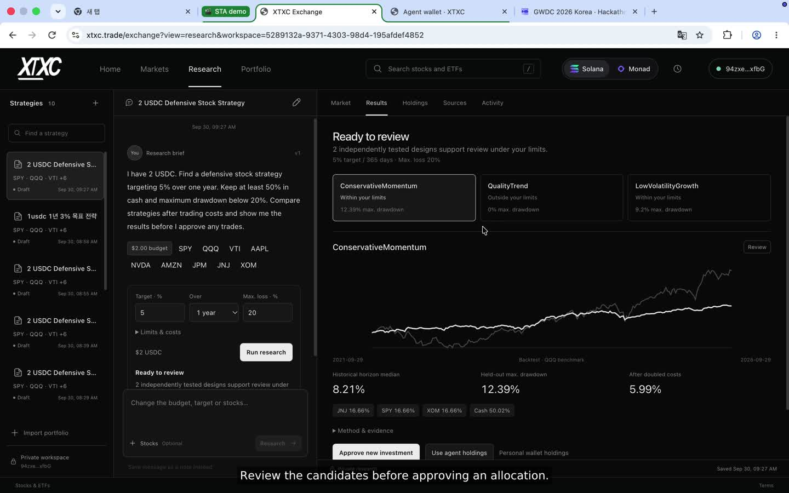

# Watch the workflow. Follow the receipts.

[Watch / download the 2:56 demo](https://github.com/xtxctrade/sta/releases/download/demo-20260930/STA-Demo-2m56s-English.mp4) · [Release and captions](https://github.com/xtxctrade/sta/releases/tag/demo-20260930) · [Kiln usage](KILN_USAGE.md)

The owner recorded the live application on September 30, 2026. The complete 273.36-second session is played at **1.55×**, producing a 176.23-second video. No scene is cut, rearranged or replaced. English captions explain the visible actions. The [media manifest](../evidence/demo-media-20260930.json) identifies the original and published files by SHA-256. Accelerated playback is not a latency measurement.

## Three requests

| Video | What to inspect |
| --- | --- |
| 00:00 | An English request: 2 USDC, 5% over one year, at least 50% cash, maximum drawdown 20%. |
| 00:16 | Actual PR7 candidate results: historical returns, drawdown and costs. |
| 00:30 | The owner signs this plan's approval; the policy is recorded on devnet. |
| 00:43 | The owner starts the allocation; the agent signs and routes the approved purchase on mainnet. |
| 00:56 | JNJ settles. The receipt and holding appear. |
| 01:01 | A separate Korean request: 1 USDC, 3% over one year, the same cash and drawdown limits. No revocation of the first strategy. |
| 01:44 | The owner approves and starts the second strategy. |
| 02:11 | Its JNJ purchase settles; the following order is tracked independently. |
| 02:18 | A third request asks for 1,000% in 30 days with maximum drawdown 1%. |
| 02:45 | Tested candidates fail the limits. The result is declined; no plan is approved for this request. |

## Mainnet purchases

These are the **agent wallet's autonomous orders**, joined to the approved research plans—not older manual-wallet activity shown elsewhere in the application. Verification re-fetched finalized transactions and checked exact signed bytes, instruction-bound quantities, fees and token balance deltas.

| Plan / leg | USDC actually debited | Raw token atoms received | Mainnet transaction | Devnet reservation | Devnet result |
| --- | ---: | ---: | --- | --- | --- |
| 2 USDC plan / JNJ | 0.3332 | 118,276 | [2GVK…](https://solscan.io/tx/2GVKRNAD37bWnUqb75XNPU48hFWpmRiASQzPSUXkVL5i7a7p1anRY3uRFQed3BCBrTd3Nj7MDuf8XeB86hQhwkvn) | [5tY6…](https://explorer.solana.com/tx/5tY6C4TWAJFGWs9ZLtw8xz3oetXNb8zW7BqPbMkXxeEjQ4SDEJYfySB2WAhh475bVMhtgiXnRtA1oQ5UdtWV1vui?cluster=devnet) | [Bo52…](https://explorer.solana.com/tx/Bo52ET8xK8oDuR5JjfMSWcLJs2gp3p4hJfXHjZxbQJRbDKaM5eMxrWzsHZVknGCi5pwT6nephF8NBopDt4iUQ71?cluster=devnet) |
| 1 USDC plan / JNJ | 0.1666 | 58,660 | [55MN…](https://solscan.io/tx/55MNiRUqLqER4brGMyXbsSNci7UF3qqdfdEXzzYkBU1hGchsqB3Dy2W24KzrU6YcdvuBza2WQ77P6zXpoL7hB5JE) | [3YDv…](https://explorer.solana.com/tx/3YDvRM7HxRc9K374tEYkiruEWq3ddBHgsYTZCESc3GRT3yj41Zayq2wL5fKEr5RcQXuPd2Zwm7V4nHNgezsSYR6a?cluster=devnet) | [4p5k…](https://explorer.solana.com/tx/4p5kcVjYT23s62wkF3BCtsYQdFEmCxQuKqLc3Gx7vHVBPsWo7pfd2Xk6pHhk5zya9U7uJCaeV3TK2kkidgbk3SLv?cluster=devnet) |
| 1 USDC plan / QQQ | 0.1666 | 22,408 | [2qXc…](https://solscan.io/tx/2qXcEoff9Gyk4M3sViQ2n5Ce6QseCFPUdi6SYo7ti9znytkmnsFYajkjoW8t3ckieNDH3uFpsA39vcborzCSESQS) | [4MaU…](https://explorer.solana.com/tx/4MaU8HQxcKFJSWKVX8bj678HEec5vkJgr8dScJe7DhMiZtpRxT6tHFqxY8MMan5P1FZcJn69UZUu99U22eszbNFA?cluster=devnet) | [4NY4…](https://explorer.solana.com/tx/4NY4hhLkJ99vY4K2fWASLNBi6vJDQsVu6Fr3ySPPL7NHtGuy4ytxhZyncSVPLXRVsa4VW8jMR7kMTy3NodHsNeVH?cluster=devnet) |

Each mainnet transaction charged 5,000 lamports in network fees. Raw token atoms are not company shares or a dollar valuation. The QQQ row includes the finalized outcome checked after the recording; the video shows the order progressing, not an invented later screen.

The two user-signed approvals are [2 USDC plan](https://explorer.solana.com/tx/RvjmYGGRyyNnW5aWDWUo6gvE2oJ1ppyBdeNZW7nbMP5wiTzmyihXRB171gHogSyhNxjDfT1Ckuo2iPGfHxAU6UE?cluster=devnet) and [1 USDC plan](https://explorer.solana.com/tx/4wR3VBbV9yZYruqb1SNCH9LTtxUSgi5VmkjuoFwP9SfgnXKc3YJxZBkY6Dpfg7KAwiHwge8GxoDd5fXJiQZjnFYW?cluster=devnet).

Agent wallet: [`5iG16qv1xzgAc8sjK5vpguTQ4VKj5sFKoYxUnDyj6vQq`](https://solscan.io/account/5iG16qv1xzgAc8sjK5vpguTQ4VKj5sFKoYxUnDyj6vQq).

## Inspect the linkage

The [execution JSON](../evidence/demo-execution-20260930.json) includes full identifiers, chain slots, receipt hashes, token pre/post balances and the eight devnet instruction checks. The [Kiln JSON](../evidence/kiln-demo-20260930.json) supplies the matching run and report IDs. Run `npm run verify:evidence` to check their internal hashes and references offline; that command does not independently contact a chain or a model provider.

The recorded budgets include cash reserves and multiple intended legs. **Individual fills are proven; full-allocation completion is not claimed.** See [the observed states](EVIDENCE.md) rather than treating an approval, hash or partial position as a completed portfolio. The devnet program records verifier attestations; it is not a trustless mainnet light client.
